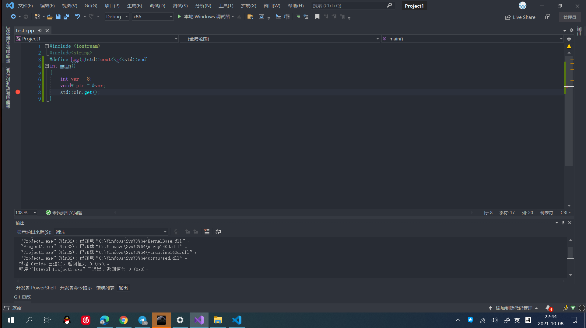
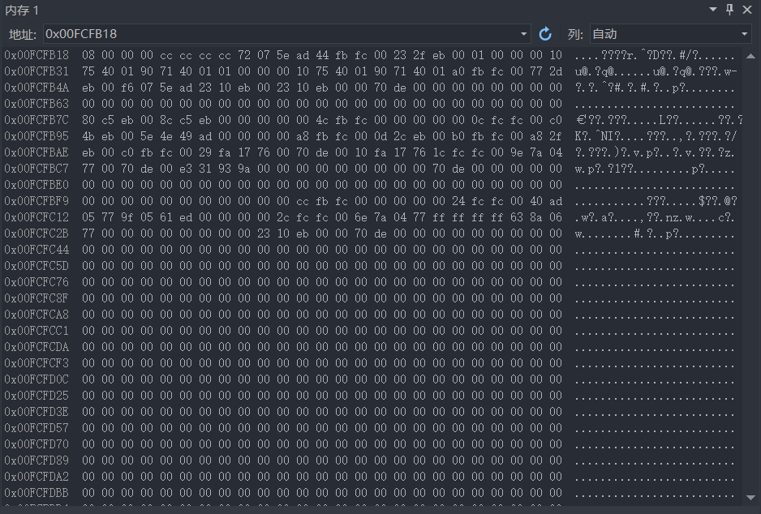
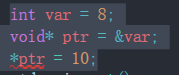
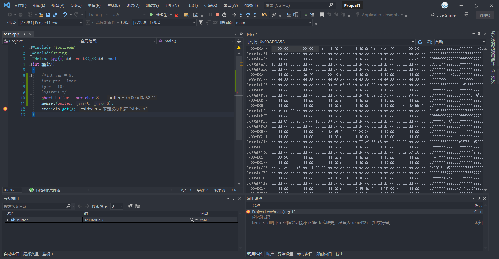

# C++
## 指针  
***
>cpu访问内存并执行命令  
***
***指针是一个整数一个数字，它存储一个内存地址***  

* 抽象理解
* 内存是一个线性的，一维的线，这条街上的每栋房子都有门牌号和地址
***
***所有类型的指针都是一个整数，存放一个内存地址***  
* 如果我们给一个指征一个类型，在那个地址的数据可能是我们给它的类型
* 一个类型不会改变一个指针  
***
**void*类型指针**  
在源码中不关心这个数据到底是什么类型，只想要存放一个地址  
```
void* ptr=0;
void* ptr=nullptr;//在c++11中加入的新类型代替null
```
创建了第一个空指针  
```
int var=8;
void* ptr=&var;
```
得到变量var的内存地址  

查看内存地址

为什么不总使用void指针,假设在读取一个数据时
有一个指向那个数据的指针
当想要写入或读取这块数据时用逆向指针去访问那块数据
```
int var = 8;
void* ptr = &var;
*ptr = 10;
```
此时会发现报错  


>报错原因

指针类型为void指针，计算机不知道该写入多少字节的数据  
代码改为
```
int var = 8;
int* ptr = &var;
*ptr = 10;
```
此时输出var结果为10  
操作指针改变了变量var的值

>指定数据改变内存的值

```
char* buffer = new char[8];
memset(buffer, 0, 8);
```

拿到了八个连续的内存都被设为了0  
```
char* buffer = new char[8];//指针 分配了8个char，把内存的开始地址存在一个指针里
memset(buffer, 0, 8);
delete[] buffer;
```
**指针只是一个存储者内存地址的整数**  
**指针只是一个存储者内存地址的整数**  
**指针只是一个存储者内存地址的整数**